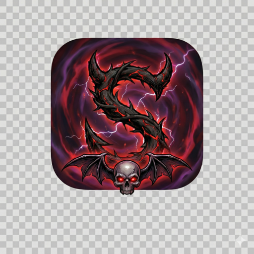

<p align="center">
  
</p>

<h1 align="center">Supervillain</h1>

<p align="center">
  Email for people who'd rather be typing.<br>
  Vim-native, zero-Electron, talks to Fastmail, Gmail, and Outlook.
</p>

<p align="center">
  
  
  
  
</p>

---

Supervillain is a keyboard-first email client built in Rust. It runs as a local web server, serves a zero-dependency vanilla JS frontend, and talks to your email provider's native API — [JMAP](https://jmap.io/) for Fastmail, REST API for Gmail, Microsoft Graph for Outlook. No Electron, no Node.js, no build step, no framework. Just `cargo install` and go.

## Features

- **Multi-provider** — Fastmail (JMAP), Gmail (REST API), Outlook (Microsoft Graph)
- **Multi-account** — Switch between accounts with `1`-`9` keys
- **Calendar sync per provider** — CalDAV (Fastmail), Google Calendar API, Outlook Calendar API
- **Vim keybindings** — `j`/`k` navigation, `gg`/`G`, modal editing in compose, `/` search
- **Split inbox** — Filterable tabs by sender, recipient, subject, or calendar invites. Auto-generated from your identities on first run
- **Gmail-style search** — `from:`, `to:`, `subject:`, `has:attachment`, `is:unread`, `before:`, `newer_than:`, and more
- **Command palette** — `Ctrl+K` for quick actions
- **Multiple identities** — All your addresses in one inbox. Replies auto-select the matching From address
- **Calendar invites** — View ICS details and RSVP directly from email
- **Attachments** — Download inline or as files
- **Undo** — `z` to reverse archive, trash, and read-state changes
- **PWA support** — Installable on mobile with offline-capable service worker
- **Zero JavaScript dependencies** — Vanilla JS frontend, no transpilation, no bundler

## Keyboard shortcuts

### Navigation

| Key | Action |
|-----|--------|
| `j` / `k` | Move down / up |
| `gg` | Jump to top |
| `G` | Jump to bottom |
| `Enter` / `o` | Open email |
| `q` / `Esc` | Back to list |
| `Space` / `Shift+Space` | Page down / up in detail view |
| `Tab` / `Shift+Tab` | Next / previous split tab |
| `Ctrl+1-9` | Jump to split tab |
| `1`-`9` | Switch account |
| `R` | Refresh |
| `?` | Show keyboard shortcuts |

### Actions

| Key | Action |
|-----|--------|
| `c` | Compose |
| `r` | Reply |
| `a` | Reply all |
| `f` | Forward |
| `e` | Archive |
| `#` | Trash |
| `u` | Toggle read / unread |
| `s` | Star / flag |
| `U` | Unsubscribe and archive all from sender |
| `z` | Undo last action |
| `/` | Search |
| `Ctrl+K` | Command palette |

### Compose

| Key | Action |
|-----|--------|
| `Ctrl+Enter` | Send |
| `Esc` | Cancel |

## Requirements

- [Rust](https://www.rust-lang.org/) 1.85+ (edition 2024)
- A [Fastmail](https://www.fastmail.com/) account with an API token, and/or:
- Google OAuth2 credentials (for Gmail)
- Microsoft app registration (for Outlook)

## Quick start

**1. Create credentials for your provider:**

- **Fastmail** — Settings > Privacy & Security > Integrations > API tokens. The token needs `Mail` and `Calendars` scopes.
- **Gmail** — Create OAuth2 credentials in Google Cloud Console with Gmail and Calendar scopes.
- **Outlook** — Register an app in Azure AD with Mail.ReadWrite and Calendars.ReadWrite permissions.

**2. Create the config file:**

```sh
mkdir -p ~/.config/supervillain
```

```ini
# ~/.config/supervillain/config

# Single Fastmail account (simplest config)
username = you@fastmail.com
api-token = fmu1-xxxxxxxxxxxxxxxx

# Or: multiple accounts with [sections]
# [fastmail]
# provider = fastmail
# username = you@fastmail.com
# api-token = fmu1-xxxxxxxxxxxxxxxx
#
# [gmail]
# provider = gmail
# username = you@gmail.com
# client-id = xxxx.apps.googleusercontent.com
# client-secret = GOCSPX-xxxx
#
# [outlook]
# provider = outlook
# username = you@company.com
# client-id = xxxx-xxxx-xxxx
# tenant-id = common
```

**3. Build and run:**

```sh
git clone https://github.com/AristoiAI/supervillain.git
cd supervillain
cargo install --path .
supervillain
```

This installs the `supervillain` binary to `~/.cargo/bin/` (on your PATH) and opens `http://127.0.0.1:8000` in your browser.

For Gmail and Outlook accounts, first run opens a browser for OAuth2 authorization. Tokens are saved to `~/.config/supervillain/tokens/{account_id}.json` and auto-refresh before expiry.

## Installation

### macOS

```sh
# Install Rust if needed
curl --proto '=https' --tlsv1.2 -sSf https://sh.rustup.rs | sh

git clone https://github.com/AristoiAI/supervillain.git
cd supervillain
cargo install --path .
```

### Linux

```sh
# Install Rust if needed (pre-installed on Omarchy)
curl --proto '=https' --tlsv1.2 -sSf https://sh.rustup.rs | sh

git clone https://github.com/AristoiAI/supervillain.git
cd supervillain
cargo install --path .
```

### Updating

Pull the latest changes and rebuild (stops the running server, rebuilds, restarts):

```sh
cd supervillain
git pull
./scripts/upgrade.sh
```

To rebuild without restarting:

```sh
cargo install --path .
```

## Configuration

### Config file

`~/.config/supervillain/config` (or `$XDG_CONFIG_HOME/supervillain/config`)

Two formats supported:

**Simple format** — single Fastmail account, `key = value` pairs. Lines starting with `#` are comments.

```ini
# Fastmail credentials
username = you@fastmail.com
api-token = fmu1-xxxxxxxxxxxxxxxx
```

**Multi-account format** — INI-style `[sections]`, each with a `provider` field.

```ini
[fastmail]
provider = fastmail
username = you@fastmail.com
api-token = fmu1-xxxxxxxxxxxxxxxx

[gmail]
provider = gmail
username = you@gmail.com
client-id = xxxx.apps.googleusercontent.com
client-secret = GOCSPX-xxxx

[outlook]
provider = outlook
username = you@company.com
client-id = xxxx-xxxx-xxxx
tenant-id = common
```

The sectionless format is fully backward compatible — it's treated as a single Fastmail account.

### Multiple identities

If you have multiple addresses in Fastmail (e.g. you@company.com, you@gmail.com, you@personal.dev), Supervillain handles this automatically:

- **Receiving** — Forward Gmail/Outlook/etc. to Fastmail. All mail lands in one inbox.
- **Sending** — All Fastmail identities appear in the From dropdown. Replies auto-select the matching address.
- **Splits** — On first run, auto-creates one tab per domain from your identities.

No multi-account configuration needed.

### Splits (inbox tabs)

Splits filter your inbox into tabs. Stored at `~/.config/supervillain/splits.json`.

On first run with no splits configured, Supervillain auto-generates one tab per email domain from your identities.

**Managing splits:**

| Action | How |
|--------|-----|
| Add | `Ctrl+K` > "New Split" |
| Delete | `Ctrl+K` > type "delete" > select split |
| Edit | Edit `~/.config/supervillain/splits.json` directly |
| Regenerate | Delete `splits.json` and restart |

**Example config:**

```json
{
  "splits": [
    {
      "id": "work",
      "name": "Work",
      "icon": "https://cdn.jsdelivr.net/gh/walkxcode/dashboard-icons/svg/fastmail.svg",
      "filters": [{ "type": "to", "pattern": "*@company.com" }]
    },
    {
      "id": "newsletters",
      "name": "Newsletters",
      "match_mode": "any",
      "filters": [
        { "type": "from", "pattern": "*@substack.com" },
        { "type": "subject", "pattern": "newsletter|digest|weekly" }
      ]
    }
  ]
}
```

**Filter types:**

| Type | Pattern | Matches |
|------|---------|---------|
| `from` | Glob (`*@example.com`) | Sender address |
| `to` | Glob (`*@company.com`) | To/CC addresses |
| `subject` | Regex (`invite\|meeting`) | Subject line |
| `calendar` | `*` | Emails with calendar invites |

**Match modes:** `any` (default) matches if any filter hits. `all` requires every filter to match.

### Environment variables

All optional when using the config file.

| Variable | Description |
|----------|-------------|
| `FASTMAIL_USERNAME` | Fallback for `username` |
| `FASTMAIL_API_TOKEN` | Fallback for `api-token` |
| `VIMMAIL_SPLITS` | Inline JSON splits config (overrides file) |
| `XDG_CONFIG_HOME` | Config directory (default: `~/.config`) |
| `RUST_LOG` | Log level (`info`, `debug`, `vimmail=debug`) |

## Search syntax

The search bar (`/`) supports Gmail-style operators:

```
from:alice@example.com           # sender address
to:team@company.com              # to/cc address
subject:meeting                  # subject contains
subject:"quarterly review"       # quoted phrases
has:attachment                   # has attachments
is:unread / is:read              # read state
is:starred / is:flagged          # flagged
before:2026-01-15                # before date
after:2026-01-15                 # after date
newer_than:7d                    # relative (d/w/m)
older_than:3m                    # relative (d/w/m)
```

Operators combine with free text: `from:@github.com is:unread pull request`

## Architecture

Supervillain is a single Rust binary that runs a local [Axum](https://github.com/tokio-rs/axum) web server on `127.0.0.1:8000`. Every API endpoint takes an optional `?account={id}` parameter that selects which provider session to use.

```
Browser (localhost:8000)
    │ REST API (/api/*?account={id})
Axum HTTP Server
    │ resolve_account() → match ProviderSession
    ├── Fastmail → JMAP + CalDAV
    ├── Gmail → Gmail REST API + Google Calendar API
    └── Outlook → Microsoft Graph (Mail + Calendar)
```

### Provider dispatch

No traits, no vtables. Three providers = three match arms on a concrete enum:

```rust
enum Provider { Fastmail, Gmail, Outlook }

enum ProviderSession {
    Fastmail(jmap::JmapSession),
    Gmail(gmail::GmailSession),
    Outlook(outlook::OutlookSession),
}
```

Each provider module exports plain functions (`gmail::list_emails()`, `outlook::list_emails()`) that take a session struct and return the same `Email`/`Mailbox`/`Identity` types. The route handler has the match statement.

### Data normalization

All providers return the same types — no provider-specific structs leak into the frontend:

- Gmail labels → `Mailbox` with roles (INBOX→inbox, SENT→sent, etc.)
- Outlook folders → `Mailbox` with roles (inbox, sentitems→sent, etc.)
- Gmail UNREAD label → `$seen` keyword absent
- Outlook `isRead: false` → `$seen` keyword absent

### Calendar dispatch

- **Fastmail** — CalDAV PUT/DELETE (existing)
- **Gmail** — Google Calendar REST API (`POST /calendars/primary/events`, lookup by `iCalUID`)
- **Outlook** — Microsoft Graph (`POST /me/events`, lookup by `iCalUId` filter)

### Search dispatch

- **Fastmail** — `to_jmap_filter()` (existing)
- **Gmail** — `to_gmail_query()` (Gmail's query syntax is nearly identical to what we already parse)
- **Outlook** — `to_graph_filter()` (OData `$filter` + `$search`)

### OAuth2 flow (Gmail, Outlook)

- First run: local callback server on random port, browser opens auth URL, exchange code for tokens
- Tokens saved to `~/.config/supervillain/tokens/{account_id}.json`
- Auto-refresh before expiry on each API call
- Same pattern as `gcloud auth login` / `gh auth login`

### Tech stack

| Layer | Technology |
|-------|------------|
| Backend | Rust, Axum 0.8, Tokio, reqwest |
| Frontend | Vanilla JS, CSS3 (no framework, no build step) |
| Protocols | JMAP ([RFC 8620](https://www.rfc-editor.org/rfc/rfc8620), [RFC 8621](https://www.rfc-editor.org/rfc/rfc8621)), Gmail REST API, Microsoft Graph API |
| Auth | Bearer token (Fastmail), OAuth2 (Gmail, Outlook) |
| Providers | Fastmail, Gmail, Outlook |

## API

All endpoints live under `/api/`. The frontend communicates exclusively through these. Multi-account endpoints accept `?account={id}`.

| Method | Path | Description |
|--------|------|-------------|
| GET | `/api/accounts` | List connected accounts |
| GET | `/api/identities` | List sender identities |
| GET | `/api/mailboxes` | List mailboxes |
| GET | `/api/emails?mailbox_id=&limit=&offset=&split_id=&search=` | List emails |
| GET | `/api/emails/{id}` | Get full email (auto-marks read) |
| POST | `/api/emails/send` | Send email |
| POST | `/api/emails/{id}/archive` | Archive |
| POST | `/api/emails/{id}/trash` | Trash |
| POST | `/api/emails/{id}/mark-read` | Mark read |
| POST | `/api/emails/{id}/mark-unread` | Mark unread |
| POST | `/api/emails/{id}/toggle-flag` | Toggle star/flag |
| POST | `/api/emails/{id}/move` | Move to mailbox |
| POST | `/api/emails/{id}/rsvp` | RSVP to calendar invite |
| POST | `/api/emails/{id}/add-to-calendar` | Add invite to calendar |
| POST | `/api/emails/{id}/unsubscribe-and-archive-all` | Unsubscribe + archive all from sender |
| GET | `/api/emails/{id}/attachments/{blob_id}/{filename}` | Download attachment |
| GET | `/api/splits` | List splits |
| POST | `/api/splits` | Create split |
| PUT | `/api/splits/{id}` | Update split |
| DELETE | `/api/splits/{id}` | Delete split |

## Project structure

```
src/
  main.rs          Entry point, config parsing, server startup
  lib.rs           Module declarations
  types.rs         Data types (Email, Mailbox, Identity, Attachment, etc.)
  error.rs         Error enum + HTTP response mapping
  jmap.rs          JMAP client — Fastmail (connect, query, send, calendar, MIME parsing)
  gmail.rs         Gmail REST API client
  outlook.rs       Microsoft Graph client (Mail + Calendar)
  oauth.rs         OAuth2 token management (shared by Gmail, Outlook)
  routes.rs        HTTP handlers + split management + provider dispatch
  search.rs        Search query parser + multi-provider filter translation
  splits.rs        Split inbox filtering + persistence
  calendar.rs      ICS parsing + RSVP generation
  glob.rs          Glob pattern matching
  validate.rs      Validation macro
static/
  index.html       Frontend shell
  app.js           All frontend logic (vanilla JS)
  style.css        Terminal-style dark theme
  icon-*.png       Favicon + PWA icons
scripts/
  upgrade.sh       Stop, rebuild, restart
```

## Development

```sh
# Build
cargo build

# Run tests
cargo test

# Lint
cargo clippy -- -D warnings

# Format
cargo fmt

# Run in development
cargo run
```

Tests cover JMAP types, glob matching, split filtering, identity-based split seeding, Gmail-style search parsing, ICS calendar parsing, JMAP filter translation, and MIME type detection.

## Contributing

1. Fork the repo and create a feature branch from `main`
2. Make your changes
3. Run `cargo fmt`, `cargo clippy -- -D warnings`, and `cargo test`
4. Open a pull request

## Roadmap

- **Multi-provider support** — Gmail and Outlook integration (in progress)
- Threading / conversation grouping
- Drafts
- Contact suggestions / address book
- Email signatures
- Offline mode
